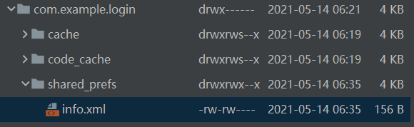

内部登录
Android系统和Windows系统一样既有内部存储也有外部存储，当需要存储一些数据时既可以选择内部存储，
也可以选择外部存储，当用户登录成功，会将用户名和密码保存在本地，使用的就是内部存储
File file = new File(getCacheDir(), "info.txt")的作用是在data\data\+apk的包名+cache路径下面
创建了一个info.txt的文件，info.txt中保存了用户名和密码，因为这个程序的包名是
com.example.login，所以info.txt的路径是data\data\com.example.login\cache

外部登录

使用SharedPreferences储存用户名和密码，SharedPreferences是直接处理xml文件，
不需要做字符串分割，存储效率会比前内部存储，和外部存储存储高
使用SharedPreferences将用户名和密码保存在本地后，
可以在\data\data\+包名+\shared_prefs目录下找到一个
info.xml文件
右侧的device file explore，找到data / data 目录,查看到sharedpreference 本地的缓存名称
并打开即可查看

